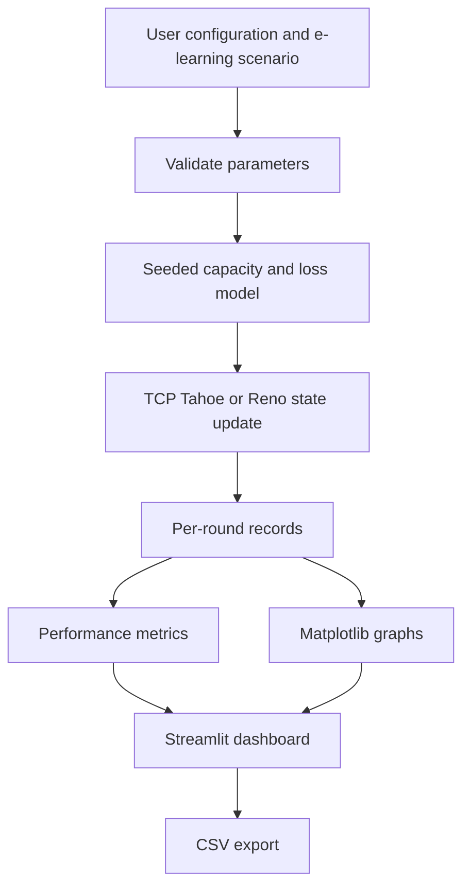

# System Architecture

```mermaid
flowchart TD
 A[User configuration and e-learning scenario] --> B[Validate parameters]
 B --> C[Seeded capacity and loss model]
 C --> D[TCP Tahoe or Reno state update]
 D --> E[Per-round records]
 E --> F[Performance metrics]
 E --> G[Matplotlib graphs]
 F --> H[Streamlit dashboard]
 G --> H
 H --> I[CSV export]
```
